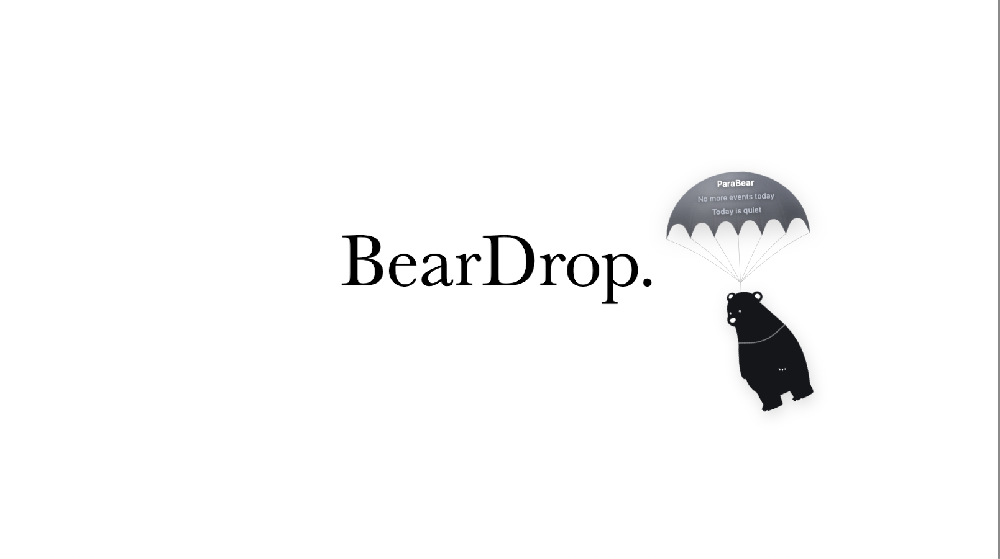

# BearDrop — ParaBear

A native macOS menu-bar companion that keeps your schedule out of your head and in your workspace. A parachuting bear drops in only when something is coming up, says what it is, and drifts away.



## Highlights

- Flies at 10, 5 and 3 minutes before an event, at its start, and once more five minutes after
- Countdown warms from grey to amber to red as the time closes in
- Grab the bear and put it down anywhere — the descent carries on from where you drop it
- Tap its belly for a greeting; tap the canopy to open that day in Google Calendar
- One flight at a time: a busy morning gets a bear, not a pile-up
- Its own Light/Dark scheme, independent of the system's — it floats over your desktop, not inside a window
- Reads Apple Calendar through EventKit; nothing leaves your Mac and there is nothing to sign into

## Built with

- Swift 6.2, SwiftUI + AppKit
- EventKit for calendar access
- A borderless `NSPanel` driven by a 60fps drift loop
- Motion written as pure functions of elapsed time — no physics engine
- SwiftPM executable package (no Xcode project)

## Menu bar


- **Calendar connection** — green once macOS has granted access
- **Drop speed** — Slow / Normal / Fast
- **Appearance** — Light or Dark
- **Call ParaBear** — fly it now, with whatever is actually coming up
- **Quit ParaBear**

## Install

Requires macOS 15 (Sequoia) or later and Xcode Command Line Tools (`xcode-select --install`).

```bash
git clone https://github.com/ylx959/BearDrop.git
cd BearDrop
Scripts/package_app.sh
cp -R .build/ParaBear.app /Applications/
open /Applications/ParaBear.app
```

There is no Dock icon and no window — look for the paw-print calendar in the menu bar. macOS asks for Calendar access on first launch; choose **Allow Full Access**, then **Call ParaBear** to check it works.

Calendars come from whatever Apple's Calendar app reads, so add accounts once in **System Settings → General → Internet Accounts**. Google, iCloud, Exchange and CalDAV all appear with nothing further to configure.

To launch at login: **System Settings → General → Login Items & Extensions → Open at Login → +**, and pick `/Applications/ParaBear.app`.

## Troubleshooting

- **"Calendar unavailable"** — access was denied. Re-enable it in **System Settings → Privacy & Security → Calendars**, or reset the prompt with `tccutil reset Calendar com.parabear.desktop` and reopen the app.
- **Nothing in the menu bar** — the bar is full and macOS hid the icon. Check with `pgrep -f ParaBear` that it is running.
- **The bear never appears on its own** — it only flies for events starting within the next hour. A quiet afternoon is silent by design.
- **"Apple could not verify ParaBear is free of malware"** — you ran a downloaded `.app` rather than one you built. Building it yourself avoids this.

Uninstall:

```bash
pkill -f ParaBear
rm -rf /Applications/ParaBear.app
tccutil reset Calendar com.parabear.desktop
rm -f ~/Library/Preferences/com.parabear.desktop.plist
```

## Local development

```bash
swift build
swift run ParaBear
swift test
```

`swift run` is for iterating on the look and the motion; it cannot reach the calendar. EventKit only grants Calendar access to a bundled `.app` carrying `NSCalendarsFullAccessUsageDescription`, so from the package ParaBear reports "Calendar unavailable" — **Call ParaBear** still flies the bear, with an empty diary on the card. Build the real thing with `Scripts/package_app.sh`.

Tests use the `Testing` framework (`@Test`, `#expect`), not XCTest. The motion math is the best-covered part of the codebase, because all of it is pure:

```bash
swift test --filter BearSwingTrajectoryTests
```

## Project structure

```text
Sources/ParaBear
├─ App/            # @main, composition root, menu bar item and its icon
├─ Domain/         # pure models and rules — milestones, flight queue, rig pose
├─ Services/       # EventKit access and polling; where the packaged art lives
├─ Overlay/        # the NSPanel, its drift loop, and click-through
├─ Features/       # SwiftUI views and view models — the rig, the canopy, the card
├─ Animation/      # motion math, all pure functions of elapsed time
├─ Settings/       # UserDefaults-backed preferences and the Settings scene
├─ Assets/         # SVG source art, shipped as a resource bundle
└─ Resources/      # privacy manifest

Packaging/         # Info.plist and entitlements
Scripts/           # package_app.sh — release build, assemble, codesign
Tests/             # swift-testing suites
```

Each folder owns one reason to change: pure math and models in `Domain` and `Animation`, UI in `Features`, system integration in `Services`, AppKit window behaviour in `Overlay`. `CLAUDE.md` carries the design notes — what was tried, what was rejected, and why.

## Rights

© 2026 BearDrop. The source is published for review; the bear artwork and canopy design are not licensed for reuse.
