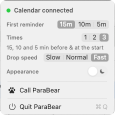

# BearDrop — ParaBear

A native macOS menu-bar companion that keeps your schedule out of your head and in your workspace. A parachuting bear drops in only when something is coming up, says what it is, and drifts away.

- Inspired by the experience of  Calendar reminders getting buried under a mountain of notifications — and me remembering the meeting or event only after getting yelled at......😭😅


## Highlights

- **Impossible to miss** — not another notification in the stack; a bear parachutes across your screen
- **You set the schedule** — how early the run-up starts and how many flights fit in it, plus one as the event begins
- **Never piles up** — one flight at a time, so a back-to-back morning gets a bear, not a queue
- **Move it, poke it, tap it** — drop the bear anywhere and the descent carries on; the canopy opens that day in Google Calendar
- **Stays on your Mac** — reads Apple Calendar through EventKit; nothing to sign into, nothing sent anywhere

## Built with

- Swift 6.2, SwiftUI + AppKit
- EventKit for calendar access
- A borderless `NSPanel` driven by a 60fps drift loop
- Motion written as pure functions of elapsed time — no physics engine
- SwiftPM executable package (no Xcode project)

## Menu bar



- **Calendar connection** — green once macOS has granted access
- **First reminder** — how far out the run-up starts: 15, 10 or 5 minutes
- **Times** — how many flights fit in it: 1, 2 or 3
- **Drop speed** — Slow / Normal / Fast
- **Appearance** — Light or Dark
- **Call ParaBear** — fly it now, with whatever is actually coming up
- **Quit ParaBear**

The run-up is the lead split into equal steps, so 15 minutes in 3 times is 15, 10 and 5. The line
under the two controls spells the result out — you never have to do that division yourself. The
flight as the event begins is always on top of the count, so one reminder still means one on the
approach and one as it starts.

## Requirements

- macOS 15 or later
- Swift 6.2 — Xcode 26 / Command Line Tools 26 or newer
(Check with `swift --version`, install with `xcode-select --install`)
- Calendar.app with at least one calendar configured
- No paid Apple Developer account needed — just clone, build, and run.

## Install

```bash
#First,you can create a file for BearDrop
git clone https://github.com/ylx959/BearDrop.git
cd BearDrop
Scripts/package_app.sh
rm -rf /Applications/ParaBear.app     # replace, don't merge: cp -R into an existing .app breaks its signature
cp -R .build/ParaBear.app /Applications/
open /Applications/ParaBear.app
```

ParaBear has no window: it lives as the paw-print calendar in the menu bar, and clicking its Dock icon opens that same menu. Choose **Allow Full Access** when macOS asks, then **Call ParaBear** to check it works.

Calendars come from whatever Apple's Calendar app reads: add accounts once in **System Settings → General → Internet Accounts** and Google, iCloud, Exchange and CalDAV all appear.


## Updating

ParaBear never contacts anything, so it cannot tell you a new version exists. Pull and rebuild when you want one:

```bash
pkill -f ParaBear                     # quit first, or `open` starts a second bear
cd BearDrop
git pull
Scripts/package_app.sh
rm -rf /Applications/ParaBear.app
cp -R .build/ParaBear.app /Applications/
open /Applications/ParaBear.app
```

Expect macOS to ask for Calendar access again — an ad-hoc signature pins permission to one exact build. Your settings are outside the app and survive. New artwork ships inside it, so a new bear arrives by rebuilding too.

## Troubleshooting

- **"Calendar unavailable"** — re-enable it in **System Settings → Privacy & Security → Calendars**, or reset the prompt with `tccutil reset Calendar com.parabear.desktop` and reopen the app.
- **Nothing in the menu bar** — the bar is full and macOS hid the icon. Click the Dock icon instead; it opens the same menu.
- **The bear never appears on its own** — it only flies for events starting within the next hour. A quiet afternoon is silent by design.
- **"Apple could not verify ParaBear is free of malware"** — that is a downloaded `.app`, not one you built.

Uninstall:

```bash
pkill -f ParaBear
rm -rf /Applications/ParaBear.app
tccutil reset Calendar com.parabear.desktop
rm -f ~/Library/Preferences/com.parabear.desktop.plist
```

## Local development

```bash
swift build
swift run ParaBear
swift test
```

`swift run` is for iterating on the look and the motion; it cannot reach the calendar. EventKit only grants Calendar access to a bundled `.app` carrying `NSCalendarsFullAccessUsageDescription`, so from the package ParaBear reports "Calendar unavailable" — **Call ParaBear** still flies the bear, with an empty diary on the card. Build the real thing with `Scripts/package_app.sh`.

Tests use the `Testing` framework (`@Test`, `#expect`), not XCTest. The motion math is the best-covered part of the codebase, because all of it is pure:

```bash
swift test --filter BearSwingTrajectoryTests
```

## Project structure

```text
Sources/ParaBear
├─ App/            # @main, composition root, menu bar item and its icon
├─ Domain/         # pure models and rules — the reminder schedule, flight queue, rig pose, what the bear says
├─ Services/       # EventKit access and polling, the hand-off to Google Calendar, where the art lives
├─ Overlay/        # the NSPanel, its drift loop, and click-through
├─ Features/       # SwiftUI views and view models — the rig, the canopy, the card
├─ Animation/      # motion math, all pure functions of elapsed time
├─ Settings/       # UserDefaults-backed preferences and the Settings scene
├─ Assets/         # SVG source art shipped as a resource bundle, and the app icon
└─ Resources/      # privacy manifest

Packaging/         # Info.plist and entitlements
Scripts/           # package_app.sh — release build, assemble, codesign; make_icon.swift draws the icon
Tests/             # swift-testing suites
```

Each folder owns one reason to change: pure math and models in `Domain` and `Animation`, UI in `Features`, system integration in `Services`, AppKit window behaviour in `Overlay`. `CLAUDE.md` carries the design notes — what was tried, what was rejected, and why.

## Rights

© 2026 BearDrop. The code is open for use and convenience — the bear artwork and canopy design are not licensed for reuse. 
